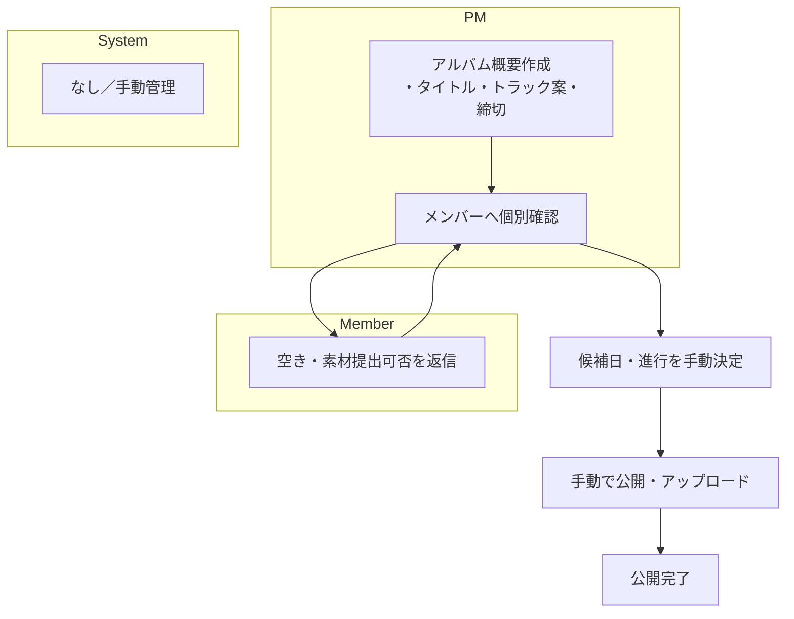
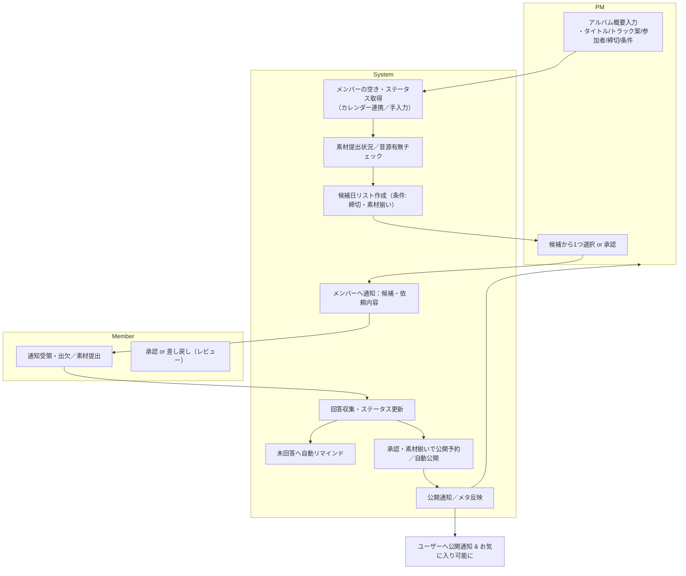

# 楽曲管理アプリ 要件定義
作成日: 2025-12-19  
作成者: MasayukiItahira

## 背景・現状
現在の楽曲・アルバム管理における状況と問題点:
- 個人またはチームでの楽曲コレクション管理が散在している（Excel・スプレッドシート、ローカルフォルダなど）。
- 楽曲メタ（トラック順、作曲者、歌詞、音源 URL）とユーザーの「お気に入り」情報が一元管理されていない。
- 複数ユーザーで共有・同期すると重複や整合性の問題が発生しやすい。

## 課題（解決すべきこと）
- 楽曲・アルバム情報を DB 化し、CRUD 操作を安全かつ一貫性を持って行えるようにする。
- ユーザーごとの「お気に入り」状態を管理し、UI/ API で即時反映できるようにする。
- 将来的な音源ファイル保存や外部連携（例: S3、配信サービス）へ拡張しやすい設計にする。

## 機能要件
### 現行の業務フロー

### あるべき業務フロー

